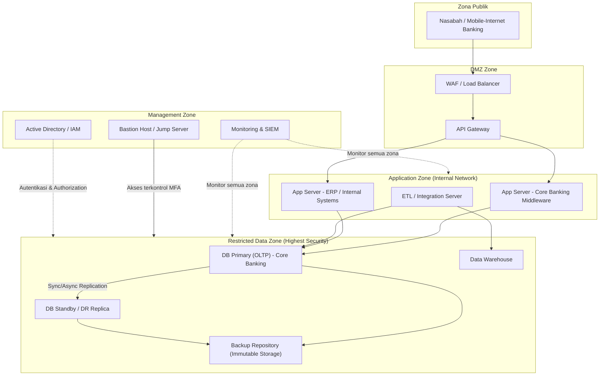
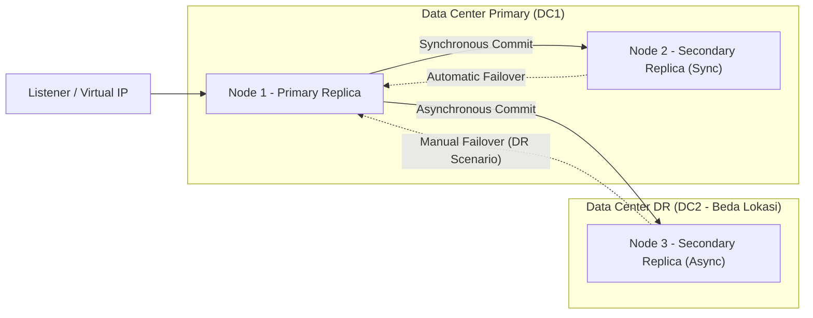
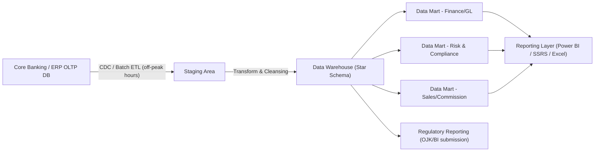
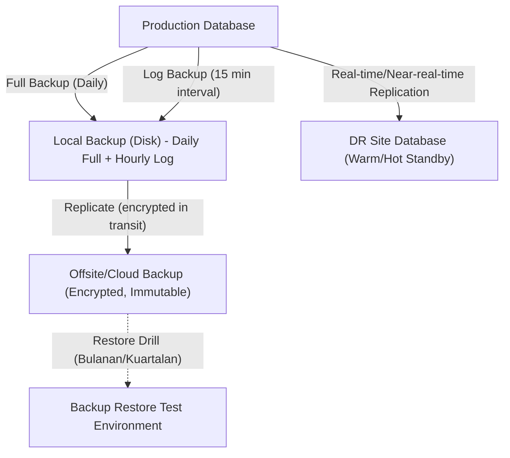
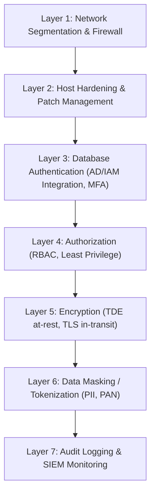

# Reference Architecture
## Database & Infrastruktur — Banking / Enterprise Grade

---

## 1. Prinsip Arsitektur

1. **Defense in depth** — keamanan berlapis (network, host, database, application)
2. **No single point of failure (SPOF)** — setiap tier kritikal memiliki redundansi
3. **Segmentasi jaringan ketat** — zona DMZ, App, Data terpisah dengan firewall
4. **Least privilege access** — akses database hanya melalui service account terkontrol
5. **Immutable audit trail** — semua perubahan data & skema tercatat dan tidak dapat diubah
6. **Tiering berdasarkan kritikalitas bisnis** — Tier-1 (core banking) hingga Tier-3 (aplikasi pendukung)

---

## 2. Klasifikasi Tier Sistem

| Tier | Contoh Sistem | RPO | RTO | Availability Target |
|---|---|---|---|---|
| Tier-1 (Kritikal) | Core Banking, RTGS/SKNBI Gateway, Kartu/Switching | ≤ 5 menit | ≤ 1 jam | 99.95%+ |
| Tier-2 (Penting) | ERP (Dynamics NAV/BC), CRM, Internet/Mobile Banking backend | ≤ 15 menit | ≤ 4 jam | 99.9% |
| Tier-3 (Pendukung) | Reporting, Data Warehouse, aplikasi internal | ≤ 1 jam | ≤ 24 jam | 99.5% |

---

## 3. Arsitektur Jaringan & Zonasi (High-Level)



**Catatan kontrol keamanan per zona:**
- Akses ke *Data Zone* **hanya** melalui *Bastion Host* dengan MFA, tidak ada direct internet exposure.
- Setiap perpindahan zona melewati firewall dengan rule eksplisit (default-deny).
- Service account aplikasi ke database dibatasi hanya pada operasi yang diperlukan (tidak pernah `sysadmin`/`dbo` untuk aplikasi).

---

## 4. Arsitektur High Availability (HA) — Contoh SQL Server Always On



- **N1 ↔ N2**: replikasi sinkron dalam satu data center → *automatic failover*, RPO ≈ 0.
- **N1 → N3**: replikasi asinkron ke DR site beda lokasi geografis → *manual/planned failover*, melindungi dari bencana skala data center.

---

## 5. Arsitektur Data Flow: OLTP → Data Warehouse → Reporting



**Prinsip:**
- ETL berjalan pada jam non-peak untuk menghindari kontensi resource dengan OLTP.
- Menggunakan **Change Data Capture (CDC)** bila memungkinkan agar beban ke sumber minimal.
- Data mart dipisah per domain bisnis untuk mempermudah *access control* granular.

---

## 6. Arsitektur Backup & Disaster Recovery



**Aturan retensi umum (sesuaikan dengan kebijakan internal & regulator):**

| Jenis Backup | Frekuensi | Retensi Lokal | Retensi Offsite |
|---|---|---|---|
| Full Backup | Harian | 14 hari | 1–7 tahun (sesuai regulasi data perbankan) |
| Differential | Setiap 6 jam | 7 hari | – |
| Transaction Log | Setiap 15 menit | 3 hari | 90 hari |
| Backup Arsip Bulanan | Bulanan | – | 5–10 tahun |

---

## 7. Arsitektur Keamanan Data (Layered Security)



---

## 8. Contoh Topologi Infrastruktur Fisik/Virtual

```
Data Center Primary
├── Compute Cluster (VMware/Hyper-V)
│   ├── DB Node 1 (Primary) — 32 vCPU / 256GB RAM / NVMe SSD
│   ├── DB Node 2 (Secondary/Sync) — spesifikasi sama
│   └── App/ETL Servers
├── Storage
│   ├── SAN Tier-1 (All-Flash, untuk data OLTP kritikal)
│   └── SAN Tier-2 (Hybrid, untuk data warehouse/arsip)
├── Network
│   ├── Core Switch (redundant, 10/25/40 Gbps)
│   ├── Firewall pair (HA)
│   └── Load Balancer pair (HA)
└── Backup
    ├── Backup Appliance (dedup storage)
    └── Link ke Offsite/Cloud (dedicated line / VPN IPSec)

Data Center DR (lokasi berbeda, idealnya beda zona gempa/banjir)
├── DB Node 3 (DR Replica)
├── Minimal compute untuk failover
└── Replicated storage
```

---

## 9. Pertimbangan Cloud / Hybrid (jika bank mulai migrasi ke cloud)

- **Data residency**: data nasabah dan transaksi umumnya wajib berada di wilayah Indonesia sesuai ketentuan OJK/PDP — pertimbangkan *hybrid cloud* dengan core data tetap on-prem/data center lokal.
- **Private connectivity**: gunakan ExpressRoute/Direct Connect, bukan internet publik, untuk komunikasi ke cloud.
- **Encryption key management**: gunakan HSM (Hardware Security Module) atau layanan KMS milik cloud provider dengan kontrol customer-managed key.
- **Landing zone terpisah** untuk workload regulated vs non-regulated.
