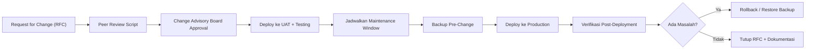

# Standards & Governance
## Database Engineering Standards — Banking/Enterprise

---

## 1. Naming Convention

### Database & Schema
```
[env]_[system]_[domain]
contoh: prod_corebanking_trx, uat_erp_finance, dev_dwh_sales
```

### Tabel
```
tbl_[domain]_[entity]           -> tbl_trx_transfer
tbl_[domain]_[entity]_hist       -> tbl_acc_balance_hist   (histori/audit)
stg_[source]_[entity]            -> stg_nav_customer       (staging ETL)
dim_[entity] / fact_[entity]     -> dim_customer, fact_sales (data warehouse)
```

### Stored Procedure / Function
```
usp_[modul]_[aksi]     -> usp_commission_calculate
fn_[modul]_[return]    -> fn_finance_get_hpp
```

### Index
```
IX_[tabel]_[kolom]          -> IX_Transaction_CustomerID
PK_[tabel]                  -> PK_Customer
FK_[tabel]_[tabel_ref]      -> FK_Transaction_Customer
```

### Environment Tagging
| Kode | Environment |
|---|---|
| DEV | Development |
| SIT | System Integration Test |
| UAT | User Acceptance Test |
| PROD | Production |
| DR | Disaster Recovery |

---

## 2. Change Management (Database Change Process)



**Aturan wajib:**
1. Tidak ada perubahan skema/data langsung di production tanpa RFC yang disetujui CAB.
2. Setiap script perubahan wajib memiliki **rollback script**.
3. Perubahan berisiko tinggi (mis. migrasi tabel besar) wajib dilakukan di *maintenance window* dan diinformasikan ke stakeholder H-3.
4. Segregation of Duties: developer yang menulis script **tidak boleh** menjadi orang yang men-deploy ke production sendirian tanpa approval kedua (four-eyes principle).

---

## 3. Data Governance

### a. Klasifikasi Data
| Klasifikasi | Contoh | Kontrol Minimum |
|---|---|---|
| Sangat Rahasia | Nomor rekening, PAN kartu, PIN/password hash, data biometrik | Enkripsi wajib, masking, akses by-exception, log semua akses |
| Rahasia | Nama nasabah, alamat, saldo, riwayat transaksi | Enkripsi in-transit wajib, RBAC ketat |
| Internal | Data operasional, konfigurasi non-sensitif | Akses internal only |
| Publik | Materi marketing, rate/kurs publik | Tidak ada batasan khusus |

### b. Data Lifecycle
1. **Creation** — data masuk lewat aplikasi tervalidasi
2. **Storage** — sesuai klasifikasi, dengan retensi jelas
3. **Usage** — akses sesuai RBAC & tujuan bisnis (purpose limitation, sesuai UU PDP)
4. **Archival** — data lama dipindah ke storage arsip sesuai kebijakan retensi
5. **Destruction** — penghapusan data yang sudah lewat masa retensi dengan metode aman (secure delete/crypto-shredding)

### c. Data Dictionary & Lineage
- Setiap tabel production wajib memiliki deskripsi kolom (business meaning, tipe data, sumber, PII flag).
- Data lineage didokumentasikan untuk setiap pipeline ETL: sumber → transformasi → tujuan.

---

## 4. Standar Kode & Script Database

- Semua stored procedure/script disimpan di **version control** (Git) — tidak ada "script hanya ada di server production".
- Wajib menggunakan **parameterized query** — tidak ada dynamic SQL yang rentan SQL Injection.
- Setiap script produksi wajib melalui **code review** minimal 1 reviewer selain penulis.
- Format & style guide konsisten (indentasi, penamaan variabel, komentar wajib pada logic kompleks).
- Testing wajib mencakup: unit test logic, data validation test, dan performance test pada volume data mendekati production.

---

## 5. Kebijakan Akses & Segregation of Duties (SoD)

| Peran | Akses Production Data | Akses Deploy Schema | Akses Approve Change |
|---|---|---|---|
| Developer | Tidak (hanya via masked/anonymized data di non-prod) | Tidak | Tidak |
| DBA Operasional | Ya (terbatas sesuai tugas, logged) | Ya (setelah approval) | Tidak |
| DBA Lead / Architect | Ya (audit trail) | Ya | Ya (sebagai reviewer teknis) |
| Change Manager/CAB | Tidak | Tidak | Ya |
| Auditor | Read-only log/audit trail | Tidak | Tidak |

---

## 6. Standar Dokumentasi Wajib per Sistem

Setiap database production minimal memiliki dokumentasi:
1. **Arsitektur & topologi** (diagram HA/DR)
2. **Data dictionary** (per tabel/kolom penting)
3. **Backup & recovery plan** (RPO/RTO, jadwal, prosedur restore)
4. **Runbook operasional** (start/stop, monitoring, eskalasi)
5. **Daftar integrasi** (sistem apa saja yang terhubung, arah data)
6. **Change log** (riwayat perubahan skema signifikan)
