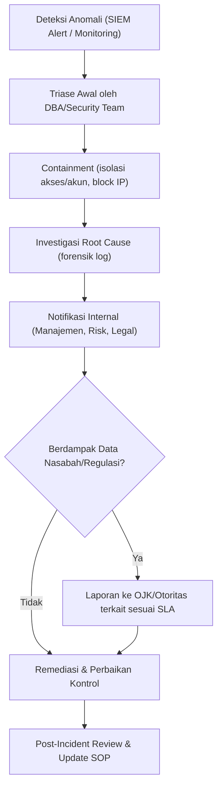

# Security & Compliance
## Database Security Hardening — Banking Grade

---

## 1. Kerangka Kepatuhan Regulasi (Konteks Indonesia)

| Regulasi/Standar | Relevansi untuk DBA |
|---|---|
| **POJK & SEOJK terkait Penerapan Manajemen Risiko TI** | Kewajiban BCP/DRP, klasifikasi tingkat kekritisan sistem, laporan insiden ke OJK |
| **UU No. 27/2022 (PDP – Perlindungan Data Pribadi)** | Purpose limitation, consent, hak subjek data, kewajiban breach notification |
| **Ketentuan BI terkait Sistem Pembayaran** | Standar keamanan untuk sistem RTGS/SKNBI, uptime requirement |
| **PCI-DSS** | Jika menyimpan/memproses data kartu (PAN) — enkripsi, tokenization, segmentasi jaringan |
| **ISO/IEC 27001** | Kerangka umum ISMS — kontrol akses, manajemen aset, kelangsungan bisnis |
| **ITIL v4** | Kerangka best practice pengelolaan layanan IT (incident, change, problem mgmt) |

> *Catatan: Sesuaikan referensi pasal/ketentuan spesifik dengan regulasi terkini karena bisa berubah — bagian legal/compliance internal perusahaan adalah rujukan resmi.*

---

## 2. Prinsip Keamanan Database

### a. Autentikasi
- Integrasi dengan **Active Directory/LDAP** — tidak ada akun lokal database untuk user manusia di production.
- **MFA wajib** untuk akses administratif ke production database.
- Service account aplikasi menggunakan **managed identity** atau vault-based credential (tidak hardcoded di source code/config file).

### b. Otorisasi
- **Role-Based Access Control (RBAC)** — akses berbasis peran, bukan per-individu.
- **Least privilege** — grant hanya permission yang diperlukan (`SELECT` untuk reporting user, tidak pernah `db_owner` untuk service account aplikasi umum).
- Review akses berkala (**access recertification**) minimal setiap 6 bulan/1 tahun.

### c. Enkripsi
- **At-rest**: Transparent Data Encryption (TDE) untuk seluruh database yang menyimpan data nasabah.
- **In-transit**: TLS 1.2 minimum (idealnya 1.3) untuk semua koneksi client-database dan replikasi antar server.
- **Key Management**: gunakan HSM atau vault terpusat (mis. Azure Key Vault, AWS KMS, HashiCorp Vault); rotasi kunci berkala.

### d. Masking & Tokenization
- Data sensitif (PAN, NIK, nomor rekening) di-*mask* pada environment non-production.
- Gunakan **tokenization** untuk data kartu jika berlaku PCI-DSS scope.
- Dynamic Data Masking untuk role tertentu yang butuh akses data tapi tidak perlu melihat nilai asli (mis. staff support level-1).

### e. Audit & Logging
- Semua akses **DDL** (perubahan skema) dan **DML kritikal** (update/delete pada tabel finansial) tercatat dengan: siapa, kapan, dari mana, apa yang diubah.
- Log terpusat di **SIEM** — tidak hanya tersimpan lokal di server database (mencegah tampering).
- Retensi log audit sesuai kebijakan (umumnya minimal 1 tahun aktif + arsip beberapa tahun sesuai regulasi).

### f. Network Security
- Database server **tidak pernah** langsung terekspos ke internet.
- Segmentasi jaringan (VLAN/subnet terpisah) antara zona aplikasi dan zona data.
- Firewall rule berbasis *default-deny*, whitelist IP/port spesifik antar tier.

---

## 3. Checklist Hardening Server Database (Contoh — SQL Server)

- [ ] Nonaktifkan fitur/service yang tidak digunakan (`xp_cmdshell`, dll.)
- [ ] Ganti port default jika kebijakan mengizinkan, kombinasikan dengan firewall rule
- [ ] Terapkan `CHECK_POLICY` dan `CHECK_EXPIRATION` pada SQL login (jika terpaksa pakai SQL Auth)
- [ ] Aktifkan **TDE** pada database berisi data sensitif
- [ ] Aktifkan **Audit** (Server Audit + Database Audit Specification)
- [ ] Terapkan **Always Encrypted** untuk kolom super sensitif (opsional, tergantung use case)
- [ ] Patch security terbaru diterapkan sesuai siklus patching (lihat dokumen Operations)
- [ ] Disable akun `sa`/default admin, atau minimal ganti nama & password kompleks + MFA di layer akses
- [ ] Batasi hak `public` role — jangan beri akses default berlebihan

## 4. Checklist Hardening Server Database (Contoh — Oracle)

- [ ] Terapkan **Oracle Database Vault** untuk pemisahan hak akses DBA vs data business
- [ ] Aktifkan **Unified Auditing**
- [ ] Terapkan **Transparent Data Encryption (TDE) tablespace**
- [ ] Nonaktifkan akun default (`SCOTT`, dll.) dan lock akun yang tidak dipakai
- [ ] Terapkan **Data Redaction** untuk kolom sensitif pada query ad-hoc
- [ ] Password profile dengan kebijakan kompleksitas & masa berlaku

---

## 5. Incident Response — Data Security

---

## 6. Audit Readiness — Dokumen yang Harus Selalu Siap

1. Daftar akses aktif ke database production (siapa punya akses apa)
2. Log perubahan skema (DDL) 12 bulan terakhir
3. Bukti backup & hasil restore test terakhir
4. Bukti patching terkini (patch level semua instance)
5. Hasil vulnerability assessment terakhir
6. Bukti pelaksanaan DR drill terakhir beserta hasilnya
7. Kebijakan retensi data & bukti pelaksanaannya
