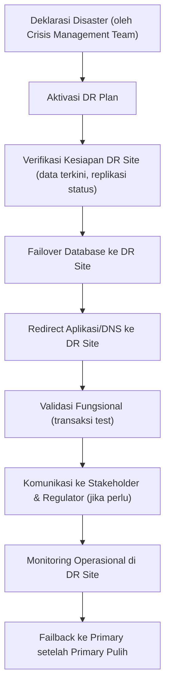
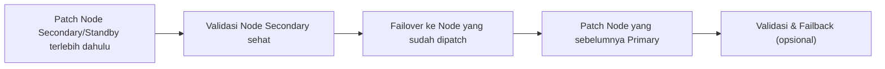
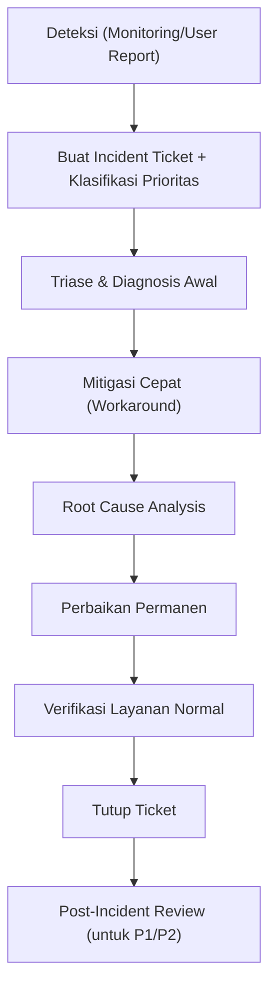

# Operations, Backup & Disaster Recovery
## Database Operational Excellence — Banking Grade

---

## 1. Definisi Metrik Kunci

| Metrik | Definisi | Target Tier-1 | Target Tier-2 |
|---|---|---|---|
| **RPO** (Recovery Point Objective) | Maksimum data yang boleh hilang | ≤ 5 menit | ≤ 15 menit |
| **RTO** (Recovery Time Objective) | Maksimum waktu pemulihan layanan | ≤ 1 jam | ≤ 4 jam |
| **MTTR** (Mean Time to Recovery) | Rata-rata waktu perbaikan insiden | < 30 menit | < 2 jam |
| **MTBF** (Mean Time Between Failures) | Rata-rata waktu antar kegagalan | > 90 hari | > 30 hari |
| **Availability** | Persentase uptime | 99.95% | 99.9% |

---

## 2. Strategi Backup

### a. Jenis Backup
| Jenis | Frekuensi (Tier-1) | Keterangan |
|---|---|---|
| Full Backup | Harian (off-peak) | Backup lengkap database |
| Differential Backup | Setiap 4–6 jam | Perubahan sejak full backup terakhir |
| Transaction Log Backup | Setiap 5–15 menit | Untuk mendukung Point-in-Time Recovery |
| Snapshot (storage-level) | Sesuai kebutuhan | Untuk recovery cepat skala besar |

### b. Prinsip 3-2-1 Backup
- **3** salinan data (1 primary + 2 backup)
- **2** media/lokasi penyimpanan berbeda
- **1** salinan disimpan **offsite** (data center berbeda/cloud, terenkripsi)

### c. Verifikasi Backup
- Setiap backup **wajib diverifikasi** integritasnya (checksum/CHECKSUM option, `RESTORE VERIFYONLY`).
- **Restore drill** terjadwal (bulanan untuk Tier-1, kuartalan untuk Tier-2/3) ke environment terpisah untuk membuktikan backup benar-benar bisa dipulihkan.
- Dokumentasikan hasil setiap restore test (waktu tempuh, status sukses/gagal, temuan).

---

## 3. Disaster Recovery (DR)

### a. Skenario DR
| Skenario | Contoh | Strategi |
|---|---|---|
| Kegagalan node tunggal | Server DB primer down | Automatic failover ke secondary (HA) |
| Kegagalan storage | SAN failure | Restore dari snapshot/replika storage |
| Bencana data center | Kebakaran, banjir, gempa | Failover ke DR site (data center berbeda) |
| Corruption data logical | Human error, bug aplikasi | Point-in-Time Recovery dari backup log |
| Ransomware/serangan siber | Enkripsi ilegal data | Restore dari backup **immutable/air-gapped** |

### b. DR Runbook — Ringkasan Alur

### c. Jadwal DR Drill
- **Tier-1**: DR drill penuh (full failover test) minimal **2x/tahun**
- **Tier-2**: minimal **1x/tahun**
- Hasil drill didokumentasikan sebagai bukti kepatuhan BCP/DRP ke audit/regulator

---

## 4. High Availability Operations

### a. Failover Testing
- Uji failover otomatis dilakukan di luar jam sibuk secara berkala (mis. kuartalan) untuk memastikan mekanisme HA benar-benar berfungsi.
- Monitoring *replication lag* secara real-time — alert jika lag melebihi threshold (mis. > 30 detik untuk sync, > 5 menit untuk async).

### b. Patching Strategy (Rolling Update)

- Patching dilakukan bergiliran (rolling) untuk meminimalkan downtime.
- Selalu ada **rollback plan** jika patch menimbulkan masalah.

---

## 5. Monitoring & Alerting

### a. Metrik yang Dimonitor
| Kategori | Metrik |
|---|---|
| Availability | Service up/down, connection count, failover events |
| Performance | CPU, memory, disk I/O latency, wait stats, slow query |
| Capacity | Disk space growth, table/index growth trend, transaction log usage |
| Replication | Replication lag, log shipping status |
| Security | Failed login attempts, privilege escalation, unusual query pattern |
| Backup | Status backup terakhir, durasi backup, ukuran backup |

### b. Eskalasi Alert (Contoh Threshold)
| Level | Kondisi | Eskalasi |
|---|---|---|
| **Warning** | CPU > 70% selama 15 menit | Notifikasi ke tim DBA (email/chat) |
| **Critical** | CPU > 90% selama 5 menit / Service Down | Page on-call DBA (SMS/call), buka incident ticket P1/P2 |
| **Emergency** | Data corruption terdeteksi / Replication putus > 1 jam | Eskalasi ke Lead DBA + Manajemen, aktivasi crisis protocol jika perlu |

---

## 6. Capacity Planning

1. Kumpulkan data historis pertumbuhan (data volume, transaksi/hari, jumlah user aktif).
2. Proyeksikan pertumbuhan 12–24 bulan ke depan berdasarkan tren + rencana bisnis (mis. produk baru, ekspansi cabang).
3. Hitung kebutuhan storage, compute, dan network dengan buffer minimal 20–30%.
4. Review kapasitas setiap kuartal, sesuaikan dengan realisasi aktual.

---

## 7. Incident Management Workflow

**SLA Respon berdasarkan Prioritas (contoh):**

| Prioritas | Definisi | Waktu Respon | Waktu Resolusi Target |
|---|---|---|---|
| P1 (Critical) | Sistem Tier-1 down total | 15 menit | 1 jam |
| P2 (High) | Sistem Tier-1 degraded / Tier-2 down | 30 menit | 4 jam |
| P3 (Medium) | Gangguan minor, ada workaround | 4 jam | 1 hari kerja |
| P4 (Low) | Request/pertanyaan non-urgent | 1 hari kerja | 3 hari kerja |
