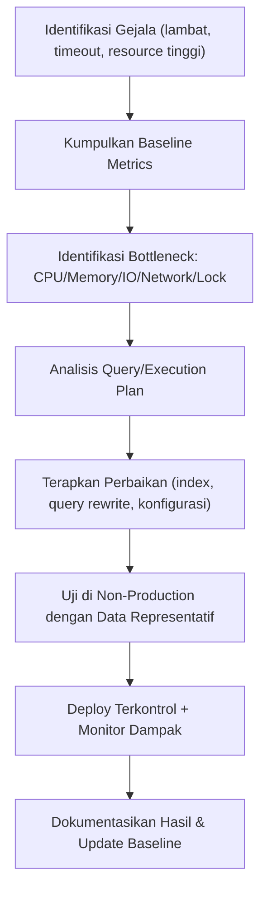

# Performance Tuning & Optimization
## Metodologi untuk Database Enterprise/Banking

---

## 1. Metodologi Umum (Top-Down)

---

## 2. Area Fokus Tuning

### a. Query-Level Tuning
- Analisis **execution plan** (identifikasi table scan yang tidak perlu, missing index, implicit conversion)
- Review penggunaan **parameterisasi** untuk plan reuse (menghindari plan cache bloat)
- Hindari `SELECT *`, ambil hanya kolom yang diperlukan
- Review penggunaan cursor/loop yang bisa digantikan set-based operation

### b. Indexing Strategy
- Index harus mendukung pola query yang **paling sering dijalankan**, bukan seluruh kombinasi kolom
- Monitor **index usage stats** — hapus index yang tidak terpakai (mengurangi overhead write)
- Pertimbangkan **covering index** untuk query reporting yang sering diakses
- Rebuild/reorganize index terjadwal sesuai tingkat fragmentasi

### c. Konfigurasi Instance
- Alokasi memory (buffer pool/SGA) disesuaikan dengan beban kerja aktual
- Pengaturan `max degree of parallelism` sesuai karakteristik workload (OLTP vs OLAP)
- Tuning I/O subsystem — pemisahan file data, log, dan tempdb/temp pada disk berbeda jika memungkinkan

### d. Locking & Concurrency
- Identifikasi **blocking chain** dan deadlock melalui trace/extended events
- Evaluasi isolation level yang tepat (Read Committed Snapshot Isolation untuk mengurangi blocking pada OLTP tinggi-konkurensi)
- Batasi transaksi long-running yang menahan lock terlalu lama

### e. Partitioning & Archiving
- Partisi tabel besar (mis. tabel transaksi) berdasarkan rentang tanggal untuk mempercepat query dan maintenance
- Arsipkan data historis yang jarang diakses ke tabel/storage terpisah, jaga tabel aktif tetap ramping

---

## 3. Tools Analisis (Contoh)

| Platform | Tools |
|---|---|
| SQL Server | Extended Events, Query Store, DMVs (`sys.dm_exec_query_stats`, dll.), SQL Server Profiler (legacy) |
| Oracle | AWR (Automatic Workload Repository), ASH (Active Session History), SQL Tuning Advisor |
| PostgreSQL | `pg_stat_statements`, `EXPLAIN ANALYZE`, `auto_explain` |
| General | Percona Toolkit (MySQL), Redgate SQL Monitor, SolarWinds DPA |

---

## 4. Load Testing Sebelum Go-Live

1. Simulasikan volume transaksi mendekati kondisi puncak (mis. akhir bulan gajian, hari kerja pertama)
2. Uji dengan volume data mendekati proyeksi 1–2 tahun ke depan (bukan hanya data kecil di UAT)
3. Ukur response time, throughput (TPS), dan resource utilization di bawah beban
4. Identifikasi *breaking point* — pada beban berapa sistem mulai degradasi

---

## 5. Capacity & Growth Analysis Template

| Parameter | Baseline Saat Ini | Proyeksi 12 Bulan | Proyeksi 24 Bulan | Aksi yang Diperlukan |
|---|---|---|---|---|
| Volume transaksi/hari | — | — | — | — |
| Ukuran database | — | — | — | — |
| Peak concurrent users | — | — | — | — |
| Storage utilization | — | — | — | — |

*(Isi dengan data aktual dari sistem monitoring saat digunakan sebagai dokumen kerja nyata.)*

---

## 6. Checklist Tuning Rutin (Maintenance Berkala)

- [ ] Update statistics (statistik optimizer) — mingguan atau setelah perubahan data signifikan
- [ ] Rebuild/reorganize index sesuai fragmentasi (>30% rebuild, 10–30% reorganize)
- [ ] Review top 10 query paling banyak konsumsi resource (CPU/IO) — mingguan
- [ ] Review pertumbuhan tempdb/temp space
- [ ] Review long-running query & blocking report
- [ ] Validasi tidak ada query baru dari deployment terbaru yang menyebabkan regresi performa
