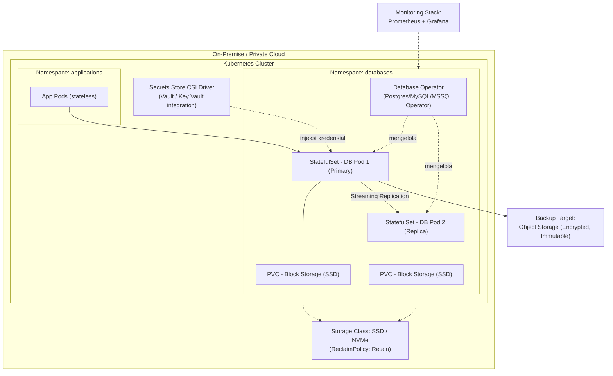
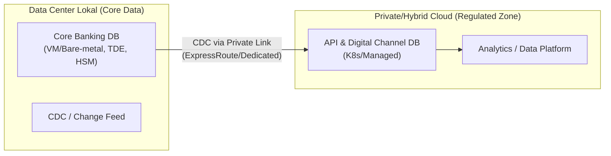

# Database di Cloud & Kubernetes
## Arsitektur Container/K8s untuk Enterprise & Banking

> ⚠️ **Konteks**: Di lingkungan perbankan Indonesia, *data residency* (POJK/UU PDP) dan kebutuhan audit sering membatasi penggunaan cloud publik. Pola yang umum: **core banking tetap on-prem**, sedangkan workload non-core (aplikasi digital, API, analytics) berjalan di private/hybrid cloud atau Kubernetes on-premise.

---

## 1. Kapan Database di Kubernetes Layak Dipertimbangkan

| Kriteria | Pertimbangan |
|---|---|
| **Cocok** | Aplikasi cloud-native baru, microservices, environment non-production, database stateless-friendly (PostgreSQL/MySQL dengan operator matang), multi-tenant SaaS internal |
| **Hati-hati** | Core banking OLTP Tier-1, sistem dengan latensi storage ketat, legacy engine tanpa dukungan container resmi vendor |
| **Alternatif** | Managed DB service (Azure SQL, RDS, Cloud SQL) untuk mengurangi operational burden — tapi tetap evaluasi data residency |

Prinsip: **database di Kubernetes bukan "Docker biasa"** — butuh operator, persistent storage yang benar, dan strategi backup yang setara dengan standar VM tradisional.

---

## 2. Pola Penempatan Database

**Keputusan desain penting:**
- Gunakan **StatefulSet + PersistentVolumeClaim**, bukan Deployment — pod harus punya identitas dan storage yang stabil.
- `ReclaimPolicy: Retain` pada PV — volume tidak boleh terhapus otomatis saat PVC dihapus.
- Kredensial via **Secrets Store CSI Driver / External Secrets** (vault), tidak pernah hardcode di manifest.
- Anti-affinity rule antar replica pod agar tidak jatuh di node fisik yang sama.

---

## 3. Peran Operator Database

Operator = kontroler Kubernetes yang membungkus knowledge operasional DBA (provisioning, failover, backup) sebagai otomasi deklaratif.

| Kemampuan Operator | Padanan Kerja Manual (DBA Tradisional) |
|---|---|
| Provisioning instance dari Custom Resource (CR) | Instalasi manual + konfigurasi |
| Automated failover antar pod | Cluster manager / Always On / Data Guard setup |
| Scheduled backup ke object storage | Maintenance plan / RMAN job |
| Rolling upgrade minor version | Patching window manual |
| Scaling storage online | Ekspansi disk via storage team |

Contoh operator yang umum: CloudNativePG / Zalando Postgres Operator (PostgreSQL), MySQL Operator, Strimzi-style pattern untuk ekosistem sejenis.

> 📌 **Catatan governance**: meskipun failover otomatis, **DBA tetap bertanggung jawab** atas review konfigurasi, tuning, capacity planning, dan approval perubahan major version. Otomasi mengubah cara kerja, bukan menghilangkan tanggung jawab.

---

## 4. Strategi Backup & DR untuk Database di K8s

1. **Backup level aplikasi (logis)**: dump/PITR-capable WAL archiving ke object storage — tetap wajib walau ada snapshot storage.
2. **Snapshot volume (CSI VolumeSnapshot)** untuk recovery cepat — tapi snapshot pada storage yang sama **bukan** pengganti backup offsite (pelanggaran prinsip 3-2-1).
3. **Retensi & verifikasi** sama dengan standar dokumen [Operations](./06-OPERATIONS-DR-BACKUP.md): restore test terjadwal wajib.
4. DR lintas cluster: replikasi streaming/log shipping ke cluster K8s di lokasi berbeda, atau restore dari backup offsite (RTO lebih panjang, biaya lebih rendah).

---

## 5. Keamanan Database di Kubernetes

| Layer | Kontrol |
|---|---|
| Network Policy | Default-deny antar namespace; hanya app namespace tertentu boleh akses port database |
| Secret Management | Secrets Store CSI / External Secrets dari vault — tidak ada kredensial plaintext di Git/manifest |
| Encryption | Enkripsi at-rest di storage class (CSI encryption) + enkripsi in-transit (TLS antar pod) |
| RBAC Kubernetes | Akses `kubectl exec` ke pod database dibatasi & diaudit; tidak ada akses broad-cluster untuk developer |
| Pod Security | Non-root user, read-only root filesystem, resource limits (mencegah noisy neighbor) |
| Audit | K8s audit log + database audit log → dikirim ke SIEM terpusat |

---

## 6. Hybrid Cloud Pattern untuk Banking

**Aturan main:**
- Data klasifikasi "Sangat Rahasia" (saldo, PAN, PII inti) tetap di data center lokal.
- Sinkronisasi ke cloud hanya melalui **private connectivity**, terenkripsi end-to-end, dengan transformasi/masking bila melewati batas regulasi.
- Landing zone cloud terpisah untuk workload regulated vs non-regulated (lihat juga [Architecture §9](./03-ARCHITECTURE.md)).

---

## 7. Checklist Go-Live Database di Kubernetes

- [ ] Storage class sesuai profil IOPS/latency workload (uji dengan load test nyata, bukan asumsi vendor)
- [ ] Backup otomatis terkonfigurasi + restore test pertama sudah dilakukan & didokumentasikan
- [ ] Network policy default-deny aktif, konektivitas aplikasi tervalidasi
- [ ] Kredensial via vault/CSI driver — tidak ada secret di Git
- [ ] Resource request/limit ditetapkan; QoS class terukur
- [ ] Monitoring (Prometheus exporter DB) & alerting menyala ke kanal on-call
- [ ] Runbook failover & recovery disesuaikan untuk konteks K8s (bukan copy-paste runbook VM)
- [ ] Approval Security & Risk untuk penempatan data di platform tersebut
