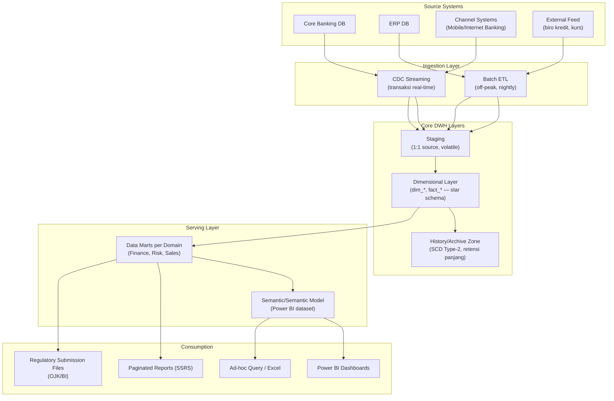
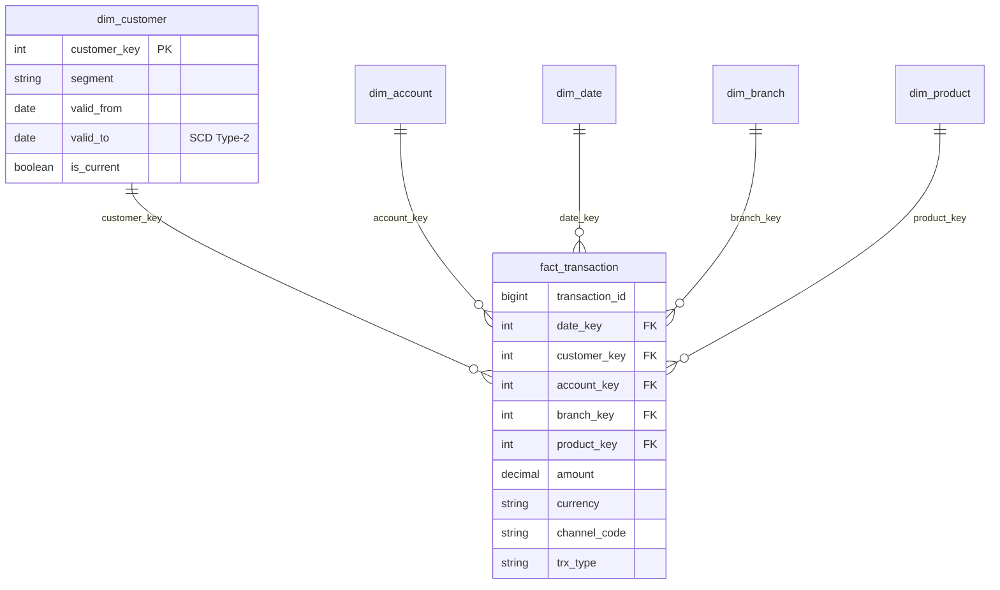
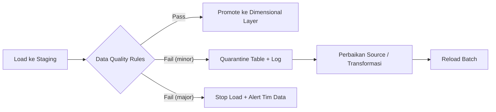

# Data Warehouse & BI
## Arsitektur DWH & Reporting — Banking/Enterprise

> Dokumen ini memperdalam bagian [Architecture §5 (Data Flow OLTP → DWH → Reporting)](./03-ARCHITECTURE.md) menjadi rancangan lengkap platform data warehouse dan business intelligence untuk kebutuhan bank: laporan regulator, MIS manajemen, dan analytics bisnis.

---

## 1. Tujuan & Konsumen Data

| Konsumen | Kebutuhan | Karakteristik |
|---|---|---|
| **Regulator (OJK/BI)** | Laporan periodik wajib (SLIK, laporan monetarias, dsb.) | Akurat, on-time, audit-trail penuh, format baku |
| **Manajemen / MIS** | Dashboard KPI harian/bulanan, drill-down | Cepat, konsisten antar periode |
| **Unit bisnis** | Analisis penjualan/komisi/portofolio nasabah | Fleksibel, self-service dengan kontrol akses |
| **Risk & Compliance** | AML, credit risk, stress test data | Data historis panjang, lineage jelas |

Prinsip: satu sumber kebenaran (**single source of truth**) — semua pelaporan resmi mengambil dari DWH, bukan langsung dari OLTP.

---

## 2. Arsitektur Layer

**Definisi layer:**
- **Staging**: replika mentah per-source, dibersihkan tiap batch. Tidak diakses user akhir.
- **Dimensional**: model star schema (`dim_customer`, `fact_transaction`, dll.) — standar industri untuk reporting.
- **History**: SCD Type-2 menyimpan riwayat perubahan atribut (mis. perubahan segmen nasabah) — penting agar angka laporan tahun lalu bisa direproduksi persis saat audit.
- **Data mart**: subset per domain dengan access control granular.

---

## 3. Desain Dimensional Model (Contoh)

**Aturan desain:**
- Grain fakta didefinisikan eksplisit sebelum desain kolom (satu baris = satu transaksi? satu transaksi × satu status?)
- Kunci surrogate (`*_key`) dipakai di DWH — kunci bisnis dari source tetap disimpan sebagai atribut.
- SCD Type-2 untuk dimensi yang atributnya berubah dan harus dilacak; SCD Type-1 cukup untuk koreksi data.

---

## 4. Strategi Load & Orchestration

| Aspek | Pendekatan |
|---|---|
| Metode ekstraksi | CDC untuk tabel transaksi high-volume; batch incremental (watermark `last_updated`) untuk lainnya |
| Jadwal | Batch nightly setelah jam operasional; streaming untuk dashboard near-real-time |
| Idempotency | Setiap load dapat di-rerun tanpa duplikasi (delete-insert berdasarkan batch_id / merge upsert) |
| Reconciliation | Row count + control total (sum amount) source vs DWH per batch — selisih = alert |
| Late-arriving data | Window reprocessing (mis. 3 hari) untuk data yang datang terlambat |
| Dependency management | Orchestrator (SQL Agent job / Airflow / Azure Data Factory) dengan retry + alerting |

> 📌 **Reconciliation adalah kontrol wajib di banking**: laporan regulator yang angkanya tidak cocok dengan source system adalah temuan audit.

---

## 5. Performa & Skalabilitas

- **Partitioning** tabel fakta besar berdasarkan tanggal (bulanan/tahunan) — mendukung partition switching untuk load & purge cepat.
- **Columnstore index** untuk workload analytical pada tabel fakta.
- Pisahkan storage/compute bila platform mendukung (mis. Synapse dedicated pool, Snowflake warehouse size).
- Materialized/indexed view untuk agregat yang sering diminta (saldo harian, total per produk).
- Monitoring: durasi ETL vs SLA window, query report > threshold, blokir ad-hoc query berat dari menabrak window ETL (workload management/resource governor).

---

## 6. Keamanan Data di Platform BI

| Risiko | Kontrol |
|---|---|
| Akses data lintas divisi | Row-Level Security (RLS) per cabang/divisi; Object-Level Security di semantic model |
| PII terekspos di dashboard | Masking/pseudonymization di data mart; akses kolom sensitif by exception |
| Export tak terkendali | Kebijakan export Power BI (label sensitivitas, log aktivitas), pembatasan download dataset |
| Laporan regulator dimodifikasi | Snapshot report read-only + versioning; file submission disimpan immutable |
| Service account berlebihan | Akun ETL hanya akses staging/mart yang relevan; tidak ada sysadmin |

Integrasi dengan [Security & Compliance](./05-SECURITY-COMPLIANCE.md): klasifikasi data berlaku sama — kolom PII/PAN di DWH diperlakukan seperti di OLTP.

---

## 7. Data Quality Framework

Kualitas DWH ditentukan sejak ingest — bukan diperbaiki saat laporan sudah salah.

Contoh aturan: not-null kolom kunci, referential integrity antar dimensi-fakta, range check (amount tidak negatif untuk jenis transaksi tertentu), duplikasi natural key, format NIK/rekening.

---

## 8. Retensi & Arsip Data Historis

| Zona | Retensi Tipikal (sesuaikan regulasi internal) |
|---|---|
| Staging | 7–30 hari |
| Detail fakta aktif (queryable) | 2–5 tahun |
| History/arsip (queryable lambat / arsip storage) | 5–10 tahun+ sesuai ketentuan perbankan |
| Snapshot laporan regulator | Permanen (bukti submission) |

Arsip menggunakan format terkompresi (columnar/parquet/backup native), dengan prosedur restore yang terdokumentasi dan diuji.

---

## 9. Checklist Go-Live DWH/BI

- [ ] Model dimensional direview oleh perwakilan finance/risk/business (business keys benar)
- [ ] Reconciliation control total berjalan otomatis + alert aktif
- [ ] RLS/object-level security diuji dengan akun representatif tiap role
- [ ] Durasi ETL penuh < maintenance window, dengan headroom minimal 30%
- [ ] Restore arsip diuji sekali sebelum go-live
- [ ] Dokumentasi data dictionary + lineage pipeline lengkap (lihat [Standards §6](./04-STANDARDS-GOVERNANCE.md))
- [ ] Angka laporan pilot dicocokkan manual dengan source oleh tim bisnis (UAT sign-off)
